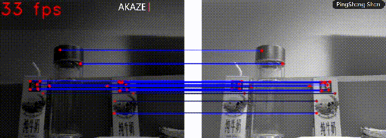

#                feature detection and matching algorithm models


## Introduction		

This warehouse mainly uses C++ to compare traditional image feature detection and matching, and deep learning feature detection and matching algorithm models. Deep learning includes superpoint-superglue, and traditional algorithms include AKAZE, SURF, ORB, etc.

1. akaze feature point detection and matching display.



2. superpoint-superpoint feature point detection and matching display.


## Dependencies

All operating environments, please strictly follow the given configuration，the configuration is as follows：

OpenCV >= 3.4

CUDA >=10.2

CUDNN>=8.02

TensorRT>=7.2.3

## How to Run

1. build.

```
cd feature-detection-matching-algorithm/
mkdir build
cd build
cmake ..
make
```

2. run camera.

deep learning algorithms.

```
./IR --deeplearning --camera 0
```

traditional algorithms.

```
./IR --traditional  --camera 0
```

3. run image-pair.

deep learning algorithms.

```
./IR --deeplearning --image-pair xx01.jpg xx02.jpg
```

traditional algorithms.

```
./IR --traditional  --image-pair xx01.jpg xx02.jpg
```

## TODO

- [ ]  Optimizing post-processing using custom TensorRT layer or Cublass.
- [ ]  Model conversion script.
- [ ] Future support for FP16/INT8.

## Discussion

Welcome to *add* WeChat(note: unit + name) and join the group discussion


## SuperPoint/SuperGlue

Superpoint pretrained models are from [magicleap/SuperPointPretrainedNetwork.](https://github.com/magicleap/SuperPointPretrainedNetwork)

SuperGlue pretrained models are from [magicleap/SuperGluePretrainedNetwork.](https://github.com/magicleap/SuperGluePretrainedNetwork)


## Reference

```
@inproceedings{sarlin20superglue,
  author    = {Paul-Edouard Sarlin and
               Daniel DeTone and
               Tomasz Malisiewicz and
               Andrew Rabinovich},
  title     = {{SuperGlue}: Learning Feature Matching with Graph Neural Networks},
  booktitle = {CVPR},
  year      = {2020},
  url       = {https://arxiv.org/abs/1911.11763}
}
```

