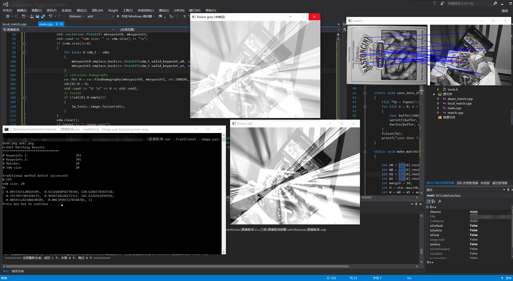
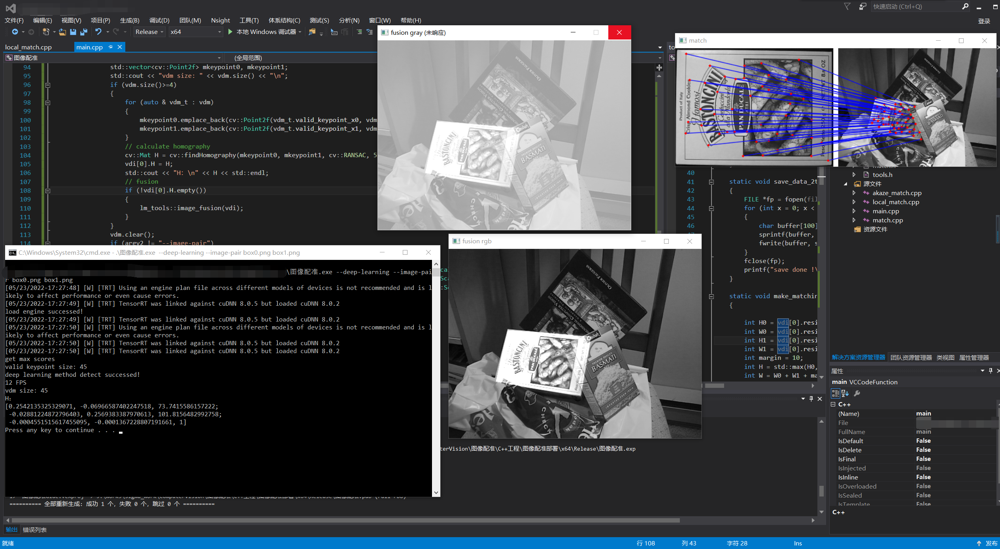

#                feature detection and matching algorithm models


## Introduction		

This warehouse mainly uses C++ to compare traditional image feature detection and matching, and deep learning feature detection and matching algorithm models. Deep learning includes superpoint-superglue, and traditional algorithms include zkaze, surf, ORB, etc.

## Dependencies

OpenCV >= 3.4

CUDA >=10.2

CUDNN>=8.02

TensorRT>=7.2.3

## Contents

1. akaze feature point detection and matching display.

##### image pair



##### camera


2. superpoint-superpoint feature point detection and matching display.

##### image pair



##### camera


#### Welcome to add WeChat and join the group discussion
.\image\523539369cec4410e5a28336208fc94.jpg

## Reference

```
@inproceedings{sarlin20superglue,
  author    = {Paul-Edouard Sarlin and
               Daniel DeTone and
               Tomasz Malisiewicz and
               Andrew Rabinovich},
  title     = {{SuperGlue}: Learning Feature Matching with Graph Neural Networks},
  booktitle = {CVPR},
  year      = {2020},
  url       = {https://arxiv.org/abs/1911.11763}
}
```

